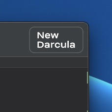

<p align="center">
    
    <h3 align="center">New Darcula VSCode Theme</h3>
    <p align="center">
	Ultra clean take on the <a href="https://www.jetbrains.com/">Jetbrains</a> Darcula theme mixed with a hint of GitHub UI.
        <br/>
        <p align="center">
		
        </p>
    </p>
</p>
<hr/>

Download or leave a review via the [VS Marketplace Repository](https://marketplace.visualstudio.com/items?itemName=e-simpson.new-darcula). Also available as a [Zed IDE extension](https://github.com/e-simpson/new-darcula-z).

## Preview


To achieve the full look:
- Install [JetBrains Icon Theme](https://marketplace.visualstudio.com/items?itemName=chadalen.vscode-jetbrains-icon-theme) extension
- Install [CustomizeUI](https://marketplace.visualstudio.com/items?itemName=iocave.customize-ui) extension
- Install [Fix VSCode Checksums](https://marketplace.visualstudio.com/items?itemName=lehni.vscode-fix-checksums) extension
- Install [JetBrains Mono](https://www.jetbrains.com/lp/mono) font
- Add the following to your VSCode settings.json (>Open User Settings (JSON))
```
{
    "window.titleBarStyle": "custom",
    "editor.minimap.enabled": false,
    "customizeUI.activityBar": "top",
    "editor.fontSize": 13,
    "editor.fontFamily": "Jetbrains Mono, Menlo, Monaco, 'Courier New', monospace",
    "editor.bracketPairColorization.enabled": true,`
    ...
}
```

## Language Support
- Javascript
- TypeScript
- React, Svelte, Vue, Angular
- GraphQL
- HTML
- PHP
- Markdown
- JSON
- shell script (.sh)
- CSS, SCSS, TailwindCSS, styled-components
- Dockerfile, Docker compose file

## Contribution
If you want something added like additional syntax highlighting, feel free to make a pull request.

## License
MIT

